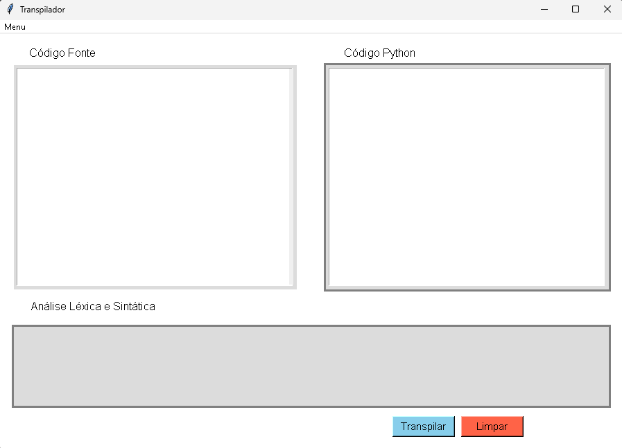
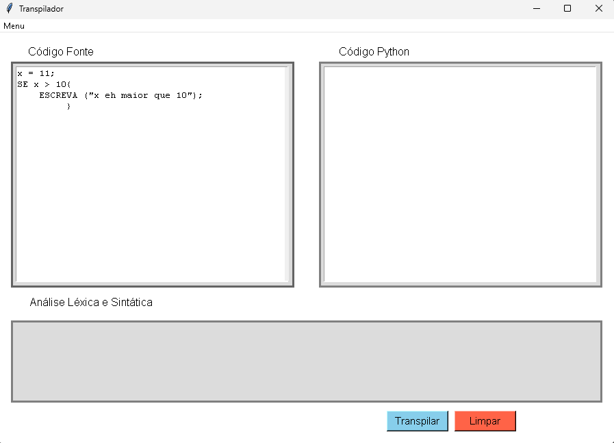
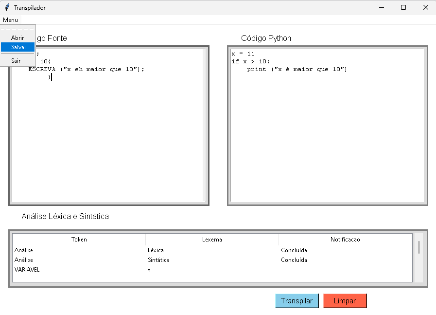

# Projeto Transpilador

## O que é um Transpilador?

Um transpilador é uma ferramenta que lê o código fonte de uma linguagem de programação e o converte para outra linguagem de programação. Este projeto tem como objetivo criar um transpilador que leia uma linguagem inventada e a transpile para Python.

## Objetivo do Projeto

O objetivo deste projeto é criar um transpilador capaz de ler uma linguagem inventada e convertê-la para Python. A linguagem inventada inclui elementos básicos de controle de fluxo, operações matemáticas e manipulação de variáveis.

## Tokens da Linguagem
| Token                        | Regex/Descrição          |
|------------------------------|--------------------------|
| SE                           | `r'SE'`                  |
| ELSE                         | `r'ELSE'`                |
| ENQUANTO                     | `r'ENQUANTO'`            |
| PARA                         | `r'PARA'`                |
| ESCREVA                      | `r'ESCREVA'`             |
| LEIA                         | `r'LEIA'`                |
| EM                           | `r'EM'`                  |
| RANGE                        | `r'RANGE'`               |
| INTEIRO                      | `r'\d+'`                 |
| DOUBLE                       | `r'([0-9]+\.[0-9]+)|([0-9]+\.[0-9]+)'|
| STRING                       | `r'"[^"]*"'`             |
| VARIAVEL                     | `r'[a-z][a-z_0-9]*'`     |
| OP_MAT_ADICAO                | `r'\+'`                  |
| OP_MAT_SUB                   | `r'-'`                   |
| OP_MAT_MULT                  | `r'\*'`                  |
| OP_MAT_POT                   | `r'\*\*'`                |
| OP_MAT_DIV                   | `r'/'`                   |
| OP_EXEC_VIRGULA              | `r','`                   |
| OP_ATRIB_IGUAL               | `r'='`                   |
| OP_ATRIB_MAIS_IGUAL          | `r'\+='`                 |
| OP_REL_DUPLO_IGUAL           | `r'=='`                  |
| OP_REL_MENOR                 | `r'<'`                   |
| OP_REL_MAIOR                 | `r'>'`                   |
| OP_FINAL_LINHA_PONTO_VIRGULA | `r';'`                   |
| OP_PRIO_ABRE_PARENTESES      | `r'\('`                  |
| OP_PRIO_FECHA_PARENTESES     | `r'\)'`                  |
| OP_PRIO_ABRE_CHAVES          | `r'\{'`                  |
| OP_PRIO_FECHA_CHAVES         | `r'\}'`                  |

## Tecnologias Utilizadas

- Python: Linguagem principal para o desenvolvimento do transpilador.
- PLY (Python Lex-Yacc): Utilizado para análise léxica e sintática.
- Tkinter: Utilizado para a interface gráfica do usuário.

## Por que Utilizar o PLY?
PLY é uma implementação em Python das ferramentas Lex e Yacc, que são amplamente utilizadas para a análise léxica e sintática. Ele foi escolhido devido à sua simplicidade e robustez, permitindo criar compiladores e transpiladores de forma eficiente.

## Explicação de Partes Importantes do Código
### Análise Léxica
A análise léxica é responsável por identificar os tokens na entrada do código fonte. Os tokens são definidos usando expressões regulares. Por exemplo:

```python t_OP_MAT_ADICAO = r'\+'  t_OP_MAT_SUB = r'-' t_INTEIRO = r'\d+' ```
### Análise Sintática
A análise sintática utiliza os tokens gerados pela análise léxica para construir a estrutura gramatical do código fonte. Isso é feito através de regras de gramática definidas em funções Python.

``` def p_declaracao_para(p):''' declaracao : PARA VARIAVEL EM RANGE OP_PRIO_ABRE_PARENTESES INTEIRO OP_EXEC_VIRGULA INTEIRO OP_PRIO_FECHA_PARENTESES bloco''' ```

### Interface Gráfica
A interface gráfica é construída usando Tkinter, permitindo ao usuário carregar arquivos de código fonte e visualizar a saída transpilada. Um exemplo de criação de interface:

``` root = Tk() root.title("Transpilador") ```

### Função Principal
A função principal do programa inicializa o lexer, o parser e a interface gráfica. É onde a execução começa:
``` if __name__ == "__main__": ```
   ``` lexer = lex.lex() ```
   ``` parser = yacc.yacc() ```
   ``` root.mainloop() ```

## Para instalar as dependências, execute:
Abra o terminal VSCODE e digite:  

```pip install ply```

## Como Rodar os Testes
Para rodar os testes, siga os passos abaixo:

1- Certifique-se de que todas as dependências estão instaladas.
2- Execute o script principal main.py:
 ```python main.py```

Aparecerá o transpilador, como na imagem abaixo.

Para testar siga as instruções.
3- Copie um dos exemplos de código fonte no arquivo testesatuais.txt
4- Cole na "telinha" Código Fonte

5- Clique em transpilar

obs:  
* Caso tenha feito um teste e queira efetuar um novo teste com um novo código fonte, clique em "Limpar" e cole o novo código fonte na "telinha" Código Fonte
* Você tem a opção de salvar o código transpilado clicando em "Menu" e depois em "Salvar"



## Integrantes do grupo

| Nome                                   | RA         |
|----------------------------------------|------------|
| Heidielton Carmo de Brito              | 1272022645 |
| Paulo Sérgio Moraes de Oliveira Filho  | 1272022847 |
| Vitor Gabriel Teixeira da Guarda Silva | 21272018696|
| Alfredo Victor do Nascimento Souza Sena|            |
